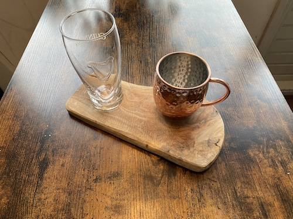
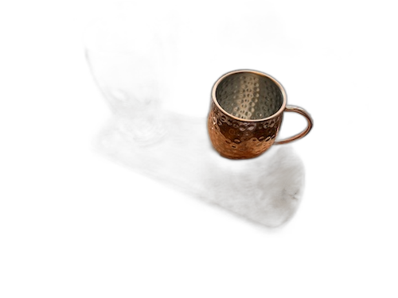
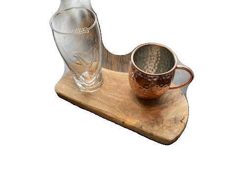
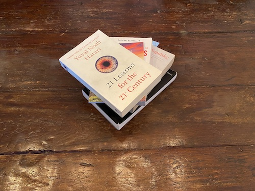
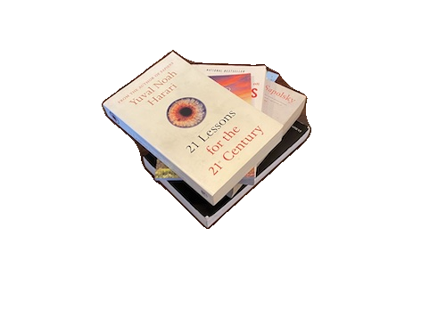
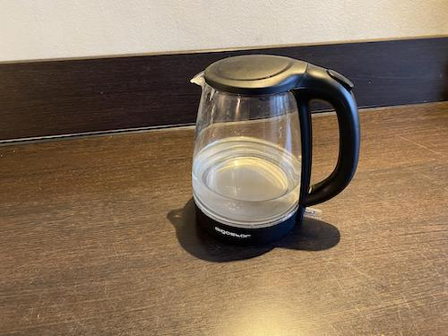
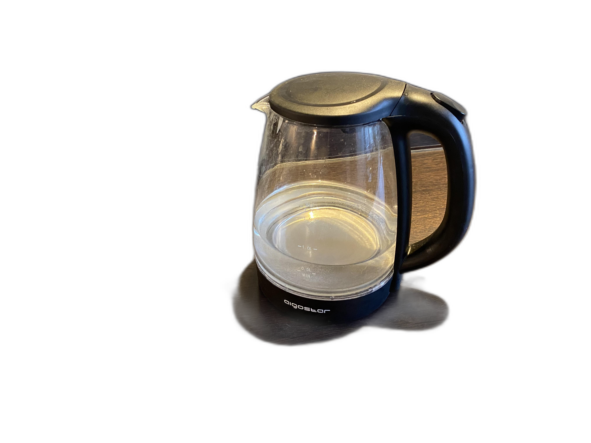
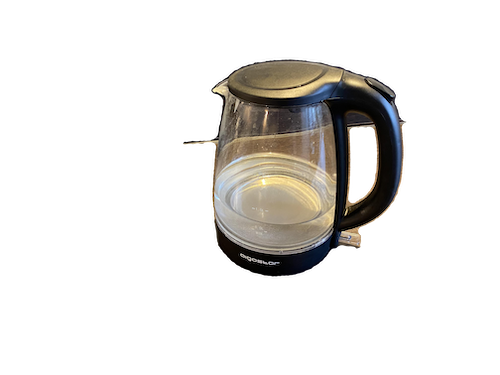

# SAMMask

_This is a small utility that attempts to remove the background from a scene where there is a clear center object with a homogene background_

This project uses Meta AI's [Segment Anything Model (SAM)](https://github.com/facebookresearch/segment-anything) to detect objects.

## Setup

- Install poetry and run `poetry install`.
- Download the [model checkpoint](https://github.com/facebookresearch/segment-anything#model-checkpoints) from the original repository and place it in the root folder. Name it `checkpoint.pth`.
- Put your images in the folder `input_data/` and run `poetry run python run.py`
- Check the `output_data/` folder for the results. Voilà!

## How does it work?

Currently, I select a couple of points on the left and right borders of the image. Next, I invert the predicted mask and select the "island" closest to the center of the image. Lastly, I remove the inner islands using opencv morphology.

## Results

I compare the results to [rembg](https://github.com/danielgatis/rembg), a popular tool to remove backgrounds.

- **TODO**: Add more results.

<table>
    <tr>
        <td>Original</td>
        <td>rembg</td>
        <td>SAMMask</td>
    </tr>
  <tr>
    <td></td>
    <td></td>
    <td></td>
  </tr>
  <tr>
    <td></td>
    <td></td>
    <td></td>
  </tr>
  <tr>
    <td></td>
    <td></td>
    <td></td>
  </tr>
</table>
